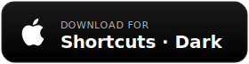
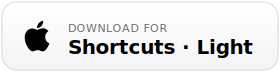
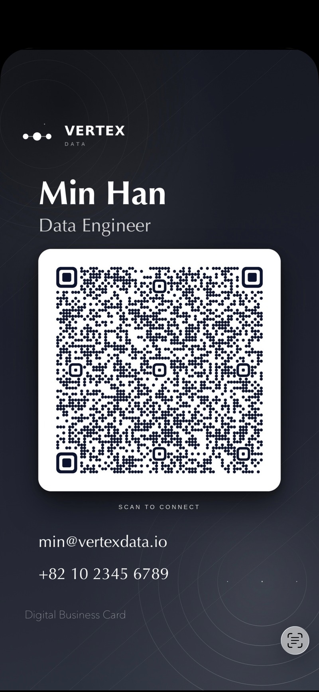
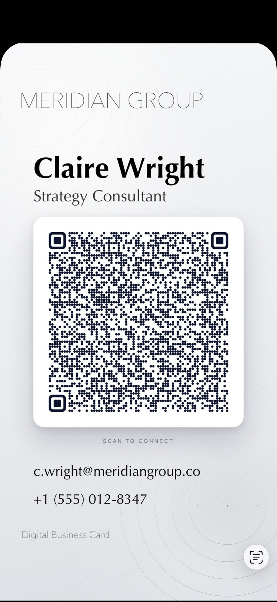
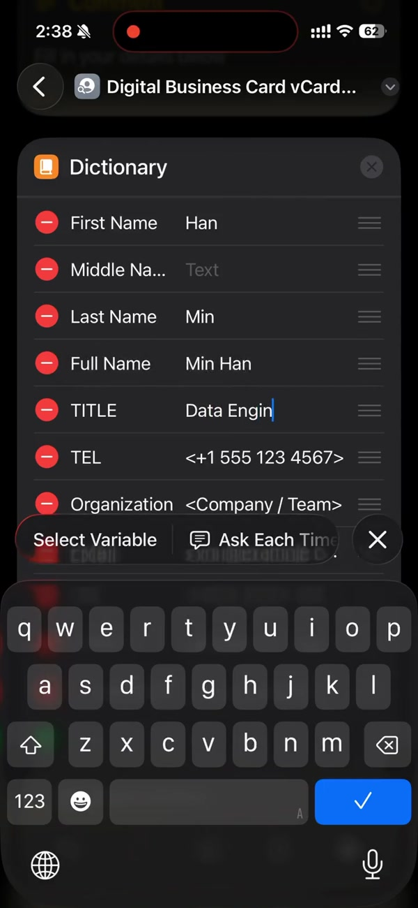
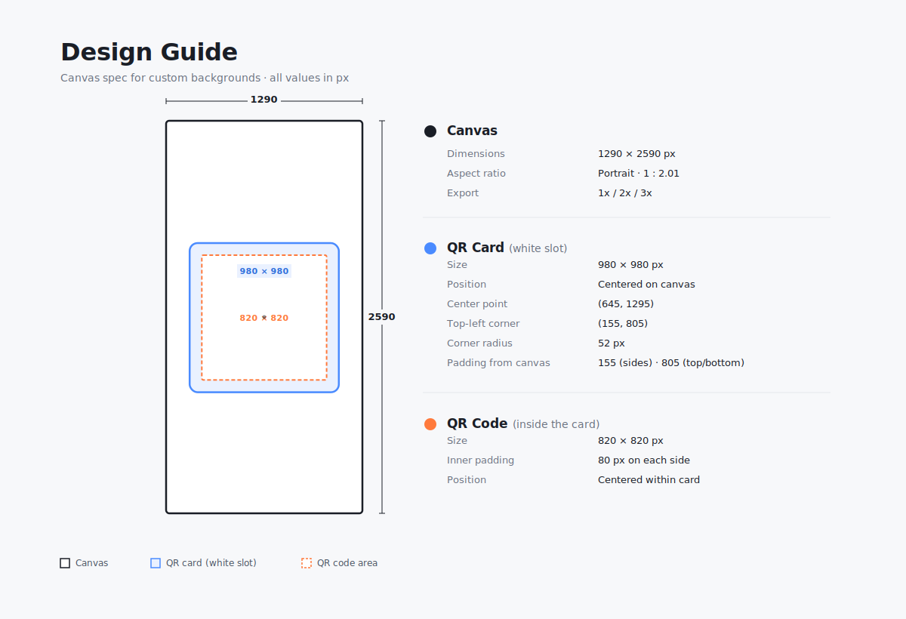

# 📇 Digital Business Card

**Share your contact info with a single tap. No app install. No paper. Just a QR.**

A fully native Apple Shortcut that generates a beautifully designed digital business card on your iPhone. Fill in your details once, tap run, and share the image anywhere.

 

&nbsp;

  

|  |  |
|:---:|:---:|
|  |  |
| **Dark · With Logo** | **Light · No Logo** |

---

## 🎬 Demo

  
   
  <a href="assets/demo.mp4">▶ Watch demo (42s, 2 MB)</a>

---

## ⬇ Installation

**Requirements**: iOS 15 or later · Shortcuts app (pre-installed on iOS)

1. Tap a download button above.
2. Shortcuts app opens with a preview — tap **Add Shortcut**.
3. First time only: if prompted, enable
   **Settings → Shortcuts → Allow Untrusted Shortcuts**.

That's it. The shortcut now lives in your library.

---

## 🚀 Quick Start

1. Open the shortcut and tap **Edit** (the ⋯ icon).
2. Fill in the **Dictionary** at the top with your details.
3. Tap **Done**, then tap the shortcut to run it.
4. The finished card is saved to your **Photos** app. Share it anywhere — AirDrop, Messages, email, or as a lock-screen wallpaper.

---

## 🎨 Customization

### 5.1 Your Info

Fill in each field in the Dictionary. All values are plain text.

| Key | Example |
|---|---|
| Last Name | `Smith` |
| Middle Name | (optional) |
| First Name | `John` |
| Full Name | `John Smith` |
| TITLE | `Analyst` |
| TEL | `+1 555 123 4567` |
| Organization | `Acme Inc.` |
| EMAIL | `you@example.com` |
| URL | `https://your-site.com` |
| PHOTO | Base64 string or direct image URL (optional) |
| X-LINKEDIN | `https://linkedin.com/in/username` (optional) |

### 5.2 Header Logic

The top slot above the QR card follows this priority:

1. **Logo** — if you paste Base64 or an image URL in the Logo field
2. **Organization** — rendered as text, if Logo is blank
3. **Blank** — if both are empty

> **Override**: If your background already has a logo baked in, insert a single space character in the Logo field to force the header blank (avoids duplication).

### 5.3 Background

A default background is included — works out of the box.

To use your own:
- **Base64 string** — offline, renders instantly (recommended)
- **Direct image URL** — requires internet, smaller data

Recommended size: **1290 × 2590 px**. See [Design Guide](#-design-guide) for full spec.

Need to convert an image to Base64? See the [Helper](#-image--base64-helper) below.

---

## 🔄 Image → Base64 Helper

Two ways to convert your image into a Base64 string for pasting into the Logo or Background field.

Use any online image-to-Base64 converter (e.g. [base64.guru](https://base64.guru/converter/encode/image)) to turn your image into a string. When pasting into the shortcut, make sure the string starts with `data:image/jpeg;base64,` or `data:image/png;base64,`.

> 🚧 A drag-and-drop converter on my portfolio site is coming soon — will be linked here.

---

## 🖼 Design Guide

For creators making custom backgrounds.

  

### 8.1 Canvas

| Property | Value |
|---|---|
| Dimensions | **1290 × 2590 px** |
| Aspect | Portrait, 1 : 2.01 |
| Export | 1x base · 2x / 3x supported |

### 8.2 QR Card (White Slot)

| Property | Value |
|---|---|
| Size | **980 × 980 px** (square) |
| Position | Centered on canvas |
| Center point | `(645, 1295)` |
| Top-left corner | `(155, 805)` |
| Corner radius | **52 px** |
| Padding | 155 px sides · 805 px top/bottom |

### 8.3 QR Code Inside the Card

| Property | Value |
|---|---|
| Size | **820 × 820 px** |
| Inner padding | 80 px |
| Position | Centered within the white card |

### 8.4 Templates

🚧 **Coming soon.** Figma / Sketch / PSD templates will be added in a future release.

---

## 💡 Why?

There are plenty of paid apps on the App Store that do exactly this — generate a QR business card. Most of them lock basic customization behind subscriptions, push ads, or force their own branding onto your card. For something this simple, paying monthly feels wrong.

Apple Shortcuts is already on every iPhone. It's free, it runs offline, and every step is visible and editable. Fork it, swap the background, change the fonts, rearrange the layout — whatever fits your brand. No paywall, no telemetry, no "Pro" tier.

Paper cards get lost. SaaS cards get held hostage. This one is just yours.

---

## 🤝 Contributing

- **Bug or idea** → [open an Issue](../../issues)
- **Share your custom background** → [GitHub Discussions](../../discussions) (coming soon)
- **Code improvements** → pull requests welcome

---

## ❓ FAQ

Does this need internet?

No, as long as your Logo and Background are stored as Base64 strings. If you use direct image URLs instead, internet is needed on every run.

Where is my data stored?

Everything stays on your device. The shortcut runs entirely locally in the Shortcuts app. The generated image is saved to your Photos library only.

The shortcut says "Untrusted" — is it safe?

Apple flags any shortcut not distributed through the official gallery as "untrusted". You can inspect every action before adding — no hidden scripts, no network calls beyond fetching images you specify.

How do I change fonts or colors?

Open the shortcut in edit mode and tweak the overlay text actions directly. Each text layer has its own font, size, and color settings.

How do I resize the logo?

Change the height in the logo resize action. Width auto-scales to keep the aspect ratio. Default: `200`.

My email or phone number gets clipped at the edge.

Lower the font size in the corresponding overlay action until it fits. Keep both EMAIL and TEL values at the same size for balance.

My QR code doesn't scan.

Make sure the QR image is at least 820 × 820 px and has enough contrast. If you're generating a vCard QR, test it with iPhone Camera before embedding.

---

## 📄 License

- **Code**: [MIT](LICENSE)
- **Gallery submissions** (future): CC BY-SA 4.0

## 🙏 Credits

Made by **Park Sewon**

If you ship something cool with this, I'd love to see it.
